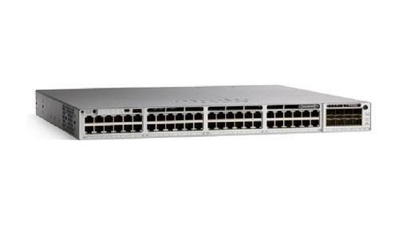
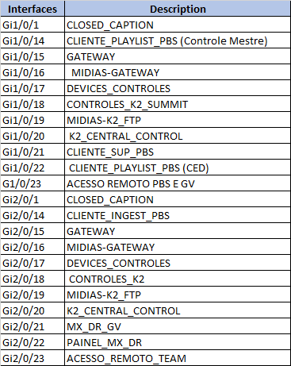
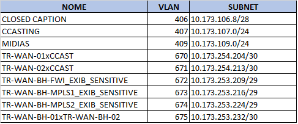

# Arquitetura Pebble - Belo Horizonte

## Overview

A automação e programação do conteúdo, Pebble, fica localizado no ION - Rio de Janeiro e o DR em Belo Horizonte. O documento atual mostra a implementação para o fluxo de tráfego do sistema DR de Belo Horizonte.

### Topologia

Topologia da solução Pebble de Belo Horizonte:

### Infraestrutura

Para a implementação da infraestrutura de automatoção de DR em Belo Horizonte, foram utilizados dois Switches Cisco C9300L-48T-4X, aprovisionados em stack, com hostname MG-BH-CTD-CCAST, ip de gerência 10.35.8.142 com acesso via SSH. Também, foi inserido no Zabbix.

Fisicamente, a pilha de switches, MG-BH-CTD-CCAST, está conectado aos Switches CORE-WAN-01/02 nas interfaces Te1/1/1 e Te2/1/1. Os demais equipamentos da Central Casting estão conectados nas interfaces conforme tabela abaixo.  

### Configuração

A  comunicação entre os equipamentos é toda realizada em Layer3. No switch BH-MG-CTD-CCAST foi configurado OSPF para propagação de rotas com os switches CORE-WAN-01/02, conforme abaixo. 

----------------------  

*router ospf 1*  

 *network 10.35.8.142 0.0.0.0 area 0.0.0.35*  
 
 *network 10.173.106.0 0.0.0.15 area 0.0.0.35*  
 
 *network 10.173.107.0 0.0.0.255 area 0.0.0.35*  
 
 *network 10.173.109.0 0.0.0.255 area 0.0.0.35*  
 
 *network 10.173.254.204 0.0.0.3 area 0.0.0.35*  
 
 *network 10.173.254.212 0.0.0.3 area 0.0.0.35*  
 
 ---------------------------  
 

 A propagação das rotas entre o CORE-WAN-01/02 e os equipamentos do MPLS e o Fortigate 600E é por meio dos anúncios nas sessões estabelecidas entre os peers. A configuração do BGP nos equipamentos CORE-WAN-01 e CORE-WAN-02 está abaixo:  
   
-----------------  
 

 *router bgp 65002*  
 
 *vrf WAN-VRF_EXIB_SENSITIVE*  
 
 *router-id 10.173.253.209*  
  
*log-neighbor-changes*  

*address-family ipv4 unicast*  

*redistribute ospf GLOBO route-map OSPF_2_BGP_EXIB_SENSITIVE*  
  
*neighbor 10.173.253.211*  

*remote-as 65002*  

*description TR-WAN-BH-FWI_EXIB_SENSITIVE*  

 *timers 10 30*  
 
 *address-family ipv4 unicast*  
 
 *weight 32769*  
 
 *prefix-list FGI-WAN-EXIB_SENSITIVE-IN in*  
 
 *prefix-list FGI-WAN-EXIB_SENSITIVE-OUT out*  
 
 *next-hop-self*  
 
 *soft-reconfiguration inbound always*  
 
 *neighbor 10.173.253.219*  
 
 *remote-as 65010*  
 
 *description TR-WAN-BH-MPLS1_EXIB_SENSITIVE*  
 
 *timers 10 30*  
 
 *address-family ipv4 unicast*  
 
 *weight 32769*  
 
 *prefix-list MPLS-WAN-EXIB-SENS-IN in*  
 
 *prefix-list MPLS-WAN-EXIB-SENS-OUT out*  
 
 *next-hop-self*  
 
 *soft-reconfiguration inbound always*  
 
 *neighbor 10.173.253.227*
 
 *remote-as 65010*  
 
 *description TR-WAN-BH-MPLS2_EXIB_SENSITIVE*  
 
 *timers 10 30*  
 
 *address-family ipv4 unicast*  
 
 *weight 32769*  
 
 *prefix-list MPLS-WAN-EXIB-SENS-IN in*

*prefix-list MPLS-WAN-EXIB-SENS-OUT out*  

*next-hop-self*  

*soft-reconfiguration inbound always*    
  
  ----------------  

Todo o tráfego entre as redes de Belo Horizonte, Rio de Janeiro e São Paulo passa pela VRF WAN-VRF_EXIB_SENSITIVE neste contexto. Roteamento com outras VRFs passam pelo Firewall por intermédio da VRF-WAN-INTERNA.

##### Prefix-list - BGP - MPLS  

Inserimos as políticas/filtros dos prefixos que são aceitos e anunciados no MPLS.  

As redes locais da Central Casting no MPLS,  foram anunciadas através da prefix-list MPLS-WAN-EXIB-SENS-OUT conforme abaixo.  

  -------------------  
  

*ip prefix-list MPLS-WAN-EXIB-SENS-OUT permit 10.173.109.0/24*  

*ip prefix-list MPLS-WAN-EXIB-SENS-OUT permit 10.173.107.0/24*    

  ------------------  
  

Na prefix-list IN insermos os prefixos que são aceitos para esta solução segue abaixo.  

JB - Jardim Botânico    

  ------------------------  
  

*ip prefix-list MPLS-WAN-EXIB-SENS-IN permit 10.12.80.0/26*  

*ip prefix-list MPLS-WAN-EXIB-SENS-IN permit 10.12.80.68/30*  

*ip prefix-list MPLS-WAN-EXIB-SENS-IN permit 10.12.80.72/30*  

*ip prefix-list MPLS-WAN-EXIB-SENS-IN permit 10.12.80.76/30*  

*ip prefix-list MPLS-WAN-EXIB-SENS-IN permit 10.12.80.78/32*  

*ip prefix-list MPLS-WAN-EXIB-SENS-IN permit 10.12.80.128/27*  

*ip prefix-list MPLS-WAN-EXIB-SENS-IN permit 10.12.81.0/24*  

*ip prefix-list MPLS-WAN-EXIB-SENS-IN permit 10.12.81.0/26*  

*ip prefix-list MPLS-WAN-EXIB-SENS-IN permit 10.12.81.64/26*  

*ip prefix-list MPLS-WAN-EXIB-SENS-IN permit 10.12.81.128/26*  

*ip prefix-list MPLS-WAN-EXIB-SENS-IN permit 10.12.81.192/26*  

*ip prefix-list MPLS-WAN-EXIB-SENS-IN permit 10.12.82.0/26*    

  ---------------------  
  

EG - Estúdios Globo    

  -------------------  
  

*ip prefix-list MPLS-WAN-EXIB-SENS-IN permit 10.12.83.0/25*  

*ip prefix-list MPLS-WAN-EXIB-SENS-IN permit 10.12.83.128/25*  

*ip prefix-list MPLS-WAN-EXIB-SENS-IN permit 10.12.84.0/29*   

  ---------------------  
  

SP - São Paulo    

  ----------------------------  
  

*ip prefix-list MPLS-WAN-EXIB-SENS-IN permit 10.193.48.128/27*  

*ip prefix-list MPLS-WAN-EXIB-SENS-IN permit 10.193.48.160/27*  

*ip prefix-list MPLS-WAN-EXIB-SENS-IN permit 10.193.48.192/27*  

*ip prefix-list MPLS-WAN-EXIB-SENS-IN permit 10.193.48.224/27*  

*ip prefix-list MPLS-WAN-EXIB-SENS-IN permit 10.193.49.0/26*  

*ip prefix-list MPLS-WAN-EXIB-SENS-IN permit 10.193.49.64/26*  

*ip prefix-list MPLS-WAN-EXIB-SENS-IN permit 10.193.49.128/26*   

*ip prefix-list MPLS-WAN-EXIB-SENS-IN permit 10.193.49.192/26*  

*ip prefix-list MPLS-WAN-EXIB-SENS-IN permit 10.193.152.0/27*  

*ip prefix-list MPLS-WAN-EXIB-SENS-IN permit 10.193.116.192/26*  

*ip prefix-list MPLS-WAN-EXIB-SENS-IN permit 10.193.50.32/27*   

  ------------------  
  

#### VLANs e SUBNETs

Segue abaixo, a tabela com as Vlans e subredes alocadas para a solução. As vlans 406, 407 e 409 são locais no switch MG-BH-CTD-CCAST. As demais são destinadas aos enlaces. 
 

#### Rotas conhecidas na VRF WAN-VRF_EXIB_SENSITIVE

Como mencionado acima, nos switches CORE-WAN-01 e CORE-WAN-02, configuramos o BGP para estabelecer sessão com o Fortigate-600E e com os neighbors do MPLS1 e MPLS2 na VRF WAN-VRF_EXIB_SENSITIVE. As rotas conhecidas nesta instância são:  

  -------------------  
  

*0.0.0.0/0, ubest/mbest: 1/0*
*via 10.173.253.211, [200/0], 6d02h, bgp-65002, internal, tag 65002*  

**10.12.80.0/26, ubest/mbest: 1/0*
 *via 10.173.253.219, [20/0], 6d02h, bgp-65002, external, tag 65010*  
 
*10.12.80.68/30, ubest/mbest: 1/0*
 *via 10.173.253.219, [20/0], 6d02h, bgp-65002, external, tag 65010*  
 
*10.12.80.72/30, ubest/mbest: 1/0*
*via 10.173.253.219, [20/0], 6d02h, bgp-65002, external, tag 65010*  

*10.12.80.76/30, ubest/mbest: 1/0*
*via 10.173.253.219, [20/0], 6d02h, bgp-65002, external, tag 65010*  

*10.12.80.78/32, ubest/mbest: 1/0*  
 *via 10.173.253.219, [20/0], 6d02h, bgp-65002, external, tag 65010*    
 
*10.12.80.128/27, ubest/mbest: 1/0*  
*via 10.173.253.219, [20/0], 6d01h, bgp-65002, external, tag 65010*  

*10.12.81.0/24, ubest/mbest: 1/0*  
*via 10.173.253.219, [20/0], 6d02h, bgp-65002, external, tag 65010*  

*10.12.81.0/26, ubest/mbest: 1/0*
   *via 10.173.253.219, [20/0], 6d02h, bgp-65002, external, tag 65010*
  
*10.12.81.64/26, ubest/mbest: 1/0*
 *via 10.173.253.219, [20/0], 6d02h, bgp-65002, external, tag 65010*  
 
*10.12.81.128/26, ubest/mbest: 1/0*
 *via 10.173.253.219, [20/0], 6d02h, bgp-65002, external, tag 65010*  
 
*10.12.81.192/26, ubest/mbest: 1/0*
  *via 10.173.253.219, [20/0], 6d02h, bgp-65002, external, tag 65010*  
  
*10.12.82.0/26, ubest/mbest: 1/0*
  *via 10.173.253.219, [20/0], 6d02h, bgp-65002, external, tag 65010*  
  
*10.12.83.0/25, ubest/mbest: 1/0*
 *via 10.173.253.219, [20/0], 6d01h, bgp-65002, external, tag 65010*  
 
*10.12.83.128/25, ubest/mbest: 1/0*
 *via 10.173.253.219, [20/0], 6d01h, bgp-65002, external, tag 65010*  
 
*10.12.84.0/29, ubest/mbest: 1/0*
 *via 10.173.253.219, [20/0], 6d02h, bgp-65002, external, tag 65010*  
 
*10.35.8.142/32, ubest/mbest: 1/0*
 *via 10.173.254.206, Vlan670, [250/101], 1w0d, ospf-GLOBO, intra*  
 
*10.173.106.0/28, ubest/mbest: 1/0*
*via 10.173.254.206, Vlan670, [250/101], 5d02h, ospf-GLOBO, intra*  

*10.173.107.0/24, ubest/mbest: 1/0*
  *via 10.173.254.206, Vlan670, [250/101], 5d02h, ospf-GLOBO, intra*  
  
*10.173.109.0/24, ubest/mbest: 1/0*
*via 10.173.254.206, Vlan670, [250/101], 5d01h, ospf-GLOBO, intra*  

*10.173.253.208/29, ubest/mbest: 1/0, attached*
    *via 10.173.253.209, Vlan672, [0/0], 1w0d, direct*  
    
*10.173.253.209/32, ubest/mbest: 1/0, attached*
  *via 10.173.253.209, Vlan672, [0/0], 1w0d, local*  
  
*10.173.253.216/29, ubest/mbest: 1/0, attached *
   *via 10.173.253.217, Vlan673, [0/0], 1w0d, direct*  
   
*10.173.253.217/32, ubest/mbest: 1/0, attached*
  *via 10.173.253.217, Vlan673, [0/0], 1w0d, local*  
  
*10.173.253.224/29, ubest/mbest: 1/0, attached*
*via 10.173.253.225, Vlan674, [0/0], 1w0d, direct*  

*10.173.253.225/32, ubest/mbest: 1/0, attached*
    *via 10.173.253.225, Vlan674, [0/0], 1w0d, local*  
    
*10.173.253.232/29, ubest/mbest: 1/0, attached*
 *via 10.173.253.233, Vlan675, [0/0], 1w0d, direct*  
 
*10.173.253.232/30, ubest/mbest: 1/0*
    *via 10.173.253.234, Vlan675, [250/200], 1w0d, ospf-GLOBO, intra*  
    
*10.173.253.233/32, ubest/mbest: 1/0, attached*
    *via 10.173.253.233, Vlan675, [0/0], 1w0d, local*  
    
*10.173.254.204/30, ubest/mbest: 1/0, attached*
    *via 10.173.254.205, Vlan670, [0/0], 1w1d, direct*  
    
*10.173.254.205/32, ubest/mbest: 1/0, attached*
    *via 10.173.254.205, Vlan670, [0/0], 1w1d, local*  
    
*10.173.254.212/30, ubest/mbest: 1/0*
*via 10.173.254.206, Vlan670, [250/101], 1w0d, ospf-GLOBO, intra*  

*10.193.48.128/27, ubest/mbest: 1/0*
    *via 10.173.253.219, [20/0], 6d02h, bgp-65002, external, tag 65010*  
    
*10.193.48.160/27, ubest/mbest: 1/0*
    *via 10.173.253.219, [20/0], 6d02h, bgp-65002, external, tag 65010*  
    
*10.193.48.192/27, ubest/mbest: 1/0*
   *via 10.173.253.219, [20/0], 6d02h, bgp-65002, external, tag 65010*  
   
*10.193.49.0/26, ubest/mbest: 1/0*
*via 10.173.253.219, [20/0], 6d02h, bgp-65002, external, tag 65010*  

*10.193.49.64/26, ubest/mbest: 1/0*
    *via 10.173.253.219, [20/0], 6d02h, bgp-65002, external, tag 65010*  
    
*10.193.49.128/26, ubest/mbest: 1/0*
    *via 10.173.253.219, [20/0], 6d02h, bgp-65002, external, tag 65010*  
    
*10.193.49.192/26, ubest/mbest: 1/0*
    *via 10.173.253.219, [20/0], 6d02h, bgp-65002, external, tag 65010*  
    
*10.193.50.32/27, ubest/mbest: 1/0*
   *via 10.173.253.219, [20/0], 6d02h, bgp-65002, external, tag 65010*  
   
*10.193.116.192/26, ubest/mbest: 1/0*
   *via 10.173.253.219, [20/0], 6d02h, bgp-65002, external, tag 65010*  
   
*10.193.152.0/27, ubest/mbest: 1/0*
    *via 10.173.253.219, [20/0], 6d02h, bgp-65002, external, tag 65010*  
    

    

